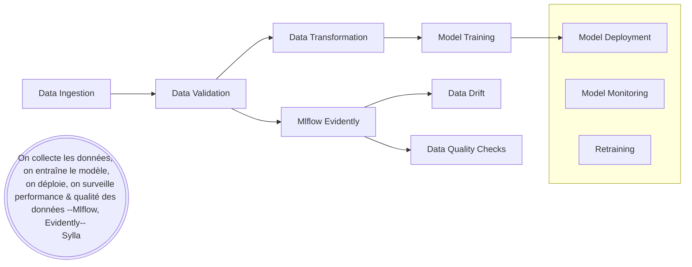

# MLOps Pipeline Project - Telco Customer Churn Prediction and Monitoring

## 📌 Objectif

Ce projet a pour but de construire un pipeline de Machine Learning complet, de l'ingestion des données à la mise en production, pour prédire si un client va se désabonner ou non et monitorer le model en cas de derive. Dans ce projet, je reponds à la problématique commune, pourquoi perdons nous des clients sans se rendre compte? 

---

##  Compétences mises en œuvre

- **MLOps & CI/CD** : Pipeline modulaire, gestion des artefacts, structuration type production
- **Data Engineering** : Ingestion, validation, transformation avec versioning
- **Machine Learning** : Modélisation non supervisée (Classification), optimisation
- **Outils** : MLflow, Docker, AWS(EC2, ECR), GitHub, Python, Scikit-learn, Pandas, NumPy, PyYAML
- **Structuration modulaire** : Architecture basée sur `src/` avec séparation des bouts
- **Docker & CI/CD pour automatisation du déploiement**

---

## Jeu de données

- **Nom** : [Teco Customer Churn Open Data](https://www.kaggle.com/datasets/blastchar/telco-customer-churn)
- **Description** : Données sur les comportement des clients (Charge, Contract, genre, PaymentMethodx, etc.)
- **Tâche** : Classification sur la variable cible `Churn`

---

## Pipeline MLOps

### Étapes du pipeline :

1. **Data Ingestion** :
   - Chargement des données brutes
   - Stockage dans un dossier artifact/raw

2. **Data Validation** :
   - Vérification du schéma
   - Détection du statut (Feature col / Traget col missing ou non )
   - Branchement d'Evidently pour la derive

3. **Data Transformation** :
   - Prétraitement (encodage, imputation, scaling)
   - Traitement des valeurs manquantes et conversion de type , suppression de cols inutiles
   - Sauvegarde du preprocessor (.pkl)
   - Sauvegarde des arrays transformés (.npy)

4. **Model Training** :
   - Entraînement du model unique Catboostclassifier
   - Recuperation des metrique
   - Branchement d'Evidently pour la derive
   - Sauvegarde du modèle final (.pkl)

5. **Tracking & Versioning** :
   - **DVC** pour versionner : données, transformations, modèle
   - **MLflow** pour tracer les expériences (paramètres, métriques, artefacts)

---

## Pipeline visuel

---

## 🚀 Deploiement sur EC2

- Configurationde  EC2  sur aws
- Déploiement sur le cloud (fastapi + streamlit)
    - FastAPI → http://<Elastic-IP>:8000
    - Streamlit → http://<Elastic-IP>:8501
- Automatisation avec GitHub Actions

---

## 🔗 Liens utiles

- [Données Kaggle - Telco Churn Open Data](https://www.kaggle.com/datasets/blastchar/telco-customer-churn)
- [GitHub du projet](https://github.com/sylla2022-arc/Telco_Customer_Churn)
- [MLflow UI / Evidently Dashboard](https://docs.evidentlyai.com/docs/library/evaluations_overview)

---

## 👤 Auteur

- **Nom** : Mahamadou SYLLA
- **Rôle** : Data Scientist spécialisé en MLOps
- **Contact** : [LinkedIn](https://www.linkedin.com/in/mahamadou-sylla/) | [GitHub](https://github.com/sylla2022-arc)
